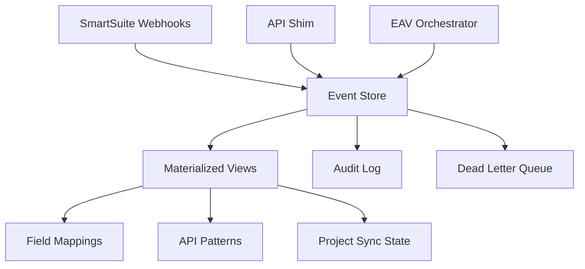

# SmartSuite Knowledge Platform - Technical Architecture

**Version:** 2.0 (Post-B0 Validation)
**Status:** Approved with Conditions
**Last Updated:** 2025-09-13

## Executive Summary

The SmartSuite Knowledge Platform is an event-sourced knowledge management system that replaces file-based field mappings with a robust, scalable solution. It serves both the SmartSuite API Shim (immediate) and EAV Orchestrator (future Phase 4).

## System Architecture

### Core Design: Progressive Event Architecture



### Infrastructure Requirements

**CRITICAL:** Separate dedicated Supabase instance required
- **Project Name:** smartsuite-knowledge-platform
- **Tier:** Pro (for connection pooling and real-time)
- **Region:** Same as EAV Orchestrator for low latency
- **Isolation:** Complete separation from other systems

### Database Schema

```sql
-- Core event store
CREATE SCHEMA knowledge;

-- Event store (append-only)
CREATE TABLE knowledge.events (
  id UUID PRIMARY KEY DEFAULT gen_random_uuid(),
  event_id UUID NOT NULL UNIQUE DEFAULT gen_random_uuid(),
  event_type TEXT NOT NULL,
  event_version INTEGER NOT NULL DEFAULT 1,
  aggregate_id TEXT NOT NULL,
  aggregate_type TEXT NOT NULL,
  event_data JSONB NOT NULL,
  metadata JSONB DEFAULT '{}',
  created_at TIMESTAMPTZ DEFAULT NOW(),
  created_by TEXT,

  -- Indexing for queries
  INDEX idx_aggregate (aggregate_type, aggregate_id),
  INDEX idx_event_type (event_type),
  INDEX idx_created_at (created_at DESC)
);

-- Materialized views for current state
CREATE TABLE knowledge.field_mappings (
  table_id TEXT PRIMARY KEY,
  solution_id TEXT NOT NULL,
  table_name TEXT NOT NULL,
  mappings JSONB NOT NULL,
  version INTEGER DEFAULT 1,
  last_event_id UUID REFERENCES knowledge.events(event_id),
  updated_at TIMESTAMPTZ DEFAULT NOW(),

  INDEX idx_solution (solution_id)
);

-- Dead letter queue for failed events
CREATE TABLE knowledge.failed_events (
  id UUID PRIMARY KEY DEFAULT gen_random_uuid(),
  original_event_id UUID,
  event_data JSONB NOT NULL,
  error_message TEXT,
  error_count INTEGER DEFAULT 1,
  last_error_at TIMESTAMPTZ DEFAULT NOW(),
  resolved BOOLEAN DEFAULT FALSE
);

-- Snapshots for projection rebuilding
CREATE TABLE knowledge.snapshots (
  id UUID PRIMARY KEY DEFAULT gen_random_uuid(),
  aggregate_id TEXT NOT NULL,
  aggregate_type TEXT NOT NULL,
  snapshot_data JSONB NOT NULL,
  event_id UUID REFERENCES knowledge.events(event_id),
  created_at TIMESTAMPTZ DEFAULT NOW(),

  UNIQUE(aggregate_type, aggregate_id)
);

-- Future: Project sync state
CREATE TABLE knowledge.project_sync_state (
  project_id TEXT PRIMARY KEY,
  smartsuite_state JSONB,
  eav_state JSONB,
  last_sync_event_id UUID REFERENCES knowledge.events(event_id),
  sync_status TEXT CHECK (sync_status IN ('synced', 'smartsuite_ahead', 'eav_ahead', 'conflict')),
  updated_at TIMESTAMPTZ DEFAULT NOW()
);
```

## Implementation Phases

### Phase 1: Core Infrastructure (Week 1)

**Event Sourcing Starter Kit:**
```typescript
// Core event handling
interface DomainEvent {
  eventId: string;
  eventType: string;
  eventVersion: number;
  aggregateId: string;
  aggregateType: string;
  eventData: any;
  metadata: {
    timestamp: Date;
    userId?: string;
    correlationId?: string;
    causationId?: string;
  };
}

class EventStore {
  async append(event: DomainEvent): Promise<void> {
    try {
      await this.supabase
        .from('knowledge.events')
        .insert(this.serializeEvent(event));

      await this.updateProjections(event);
    } catch (error) {
      await this.handleFailedEvent(event, error);
    }
  }

  async getEvents(aggregateId: string, fromVersion?: number): Promise<DomainEvent[]> {
    // Retrieve events for aggregate
  }

  async getSnapshot(aggregateId: string): Promise<any> {
    // Get latest snapshot for faster rebuilding
  }
}
```

### Phase 2: Knowledge Service (Week 2)

**Field Mapping Service:**
```typescript
class FieldMappingService {
  constructor(
    private eventStore: EventStore,
    private cache: CacheService
  ) {}

  async updateMapping(tableId: string, mappings: any): Promise<void> {
    const event: DomainEvent = {
      eventId: uuid(),
      eventType: 'FieldMappingUpdated',
      eventVersion: 1,
      aggregateId: tableId,
      aggregateType: 'FieldMapping',
      eventData: { mappings },
      metadata: {
        timestamp: new Date(),
        userId: this.getCurrentUser()
      }
    };

    await this.eventStore.append(event);
    await this.cache.invalidate(tableId);
  }

  async getMapping(tableId: string): Promise<any> {
    // Try cache first
    const cached = await this.cache.get(tableId);
    if (cached) return cached;

    // Query materialized view
    const { data } = await this.supabase
      .from('knowledge.field_mappings')
      .select('*')
      .eq('table_id', tableId)
      .single();

    if (data) {
      await this.cache.set(tableId, data.mappings);
      return data.mappings;
    }

    return null;
  }
}
```

### Phase 3: Automation & Sync (Week 3)

**SmartSuite Webhook Handler:**
```typescript
class SmartSuiteWebhookHandler {
  async handleSchemaChange(payload: any): Promise<void> {
    const event: DomainEvent = {
      eventType: 'SchemaChanged',
      aggregateId: payload.tableId,
      aggregateType: 'SmartSuiteTable',
      eventData: payload.changes,
      // ...
    };

    await this.eventStore.append(event);
    await this.notifySubscribers(event);
  }
}
```

### Phase 4: EAV Integration (Future)

**Bi-directional Sync:**
```typescript
class SmartSuiteEAVSync {
  async syncProjectStatus(projectId: string, status: any, source: 'smartsuite' | 'eav'): Promise<void> {
    const event: DomainEvent = {
      eventType: 'ProjectStatusSynced',
      aggregateId: projectId,
      aggregateType: 'Project',
      eventData: { status, source },
      // ...
    };

    await this.eventStore.append(event);

    // Push to other system
    if (source === 'eav') {
      await this.pushToSmartSuite(projectId, status);
    } else {
      await this.pushToEAV(projectId, status);
    }
  }
}
```

## Migration Strategy

### From YAML Files to Event Store

```typescript
class MigrationService {
  async migrateFieldMappings(): Promise<void> {
    const yamlFiles = await this.loadYamlFiles();

    for (const file of yamlFiles) {
      const event: DomainEvent = {
        eventType: 'FieldMappingMigrated',
        aggregateId: file.tableId,
        aggregateType: 'FieldMapping',
        eventData: {
          mappings: file.mappings,
          source: 'yaml_migration'
        },
        // ...
      };

      await this.eventStore.append(event);
    }
  }
}
```

### Rollback Plan

1. **Feature Flags:**
```typescript
if (featureFlags.useKnowledgePlatform) {
  return knowledgeService.getMapping(tableId);
} else {
  return yamlLoader.getMapping(tableId);
}
```

2. **Data Export:**
```typescript
async function exportCurrentState(): Promise<void> {
  const mappings = await getAllMappings();
  await writeToYaml(mappings);
}
```

## Monitoring & Operations

### Key Metrics

```typescript
// Projection lag monitoring
SELECT
  MAX(e.created_at) as last_event,
  MAX(fm.updated_at) as last_projection,
  EXTRACT(EPOCH FROM (MAX(e.created_at) - MAX(fm.updated_at))) as lag_seconds
FROM knowledge.events e
CROSS JOIN knowledge.field_mappings fm;

// Failed event monitoring
SELECT COUNT(*) as failed_count
FROM knowledge.failed_events
WHERE resolved = FALSE;
```

### Developer Tools

```typescript
// Event inspector CLI
class EventInspector {
  async inspectAggregate(aggregateId: string): Promise<void> {
    const events = await this.eventStore.getEvents(aggregateId);
    const snapshot = await this.eventStore.getSnapshot(aggregateId);

    console.log('Aggregate:', aggregateId);
    console.log('Events:', events.length);
    console.log('Current State:', snapshot);

    // Show event timeline
    events.forEach(e => {
      console.log(`${e.metadata.timestamp}: ${e.eventType}`);
    });
  }
}
```

## Performance Requirements

- Field mapping lookups: <50ms
- Event append: <100ms
- Projection update: <200ms
- Cache hit ratio: >90%
- Event store availability: 99.9%

## Security Model

- Row-level security on all tables
- Service-specific authentication keys
- Audit logging for all mutations
- Encrypted event data for sensitive information
- Rate limiting on webhook endpoints

## Success Criteria

### Phase 1
- ✅ Event store operational
- ✅ Basic projections working
- ✅ Dead letter queue functional
- ✅ Monitoring dashboard created

### Phase 2
- ✅ All YAML files migrated
- ✅ API Shim integrated
- ✅ Performance targets met
- ✅ Zero data loss verified

### Phase 3
- ✅ Webhook automation working
- ✅ Real-time updates functional
- ✅ Knowledge validation operational
- ✅ Notifications configured

### Phase 4
- ✅ Bi-directional sync working
- ✅ Conflict resolution tested
- ✅ Scale targets achieved
- ✅ Full audit trail maintained

---

// Critical-Engineer: validated for production readiness with separate infrastructure
// Technical-Architect: designed for progressive enhancement and future scale
// Requirements-Steward: aligned with both immediate and future requirements